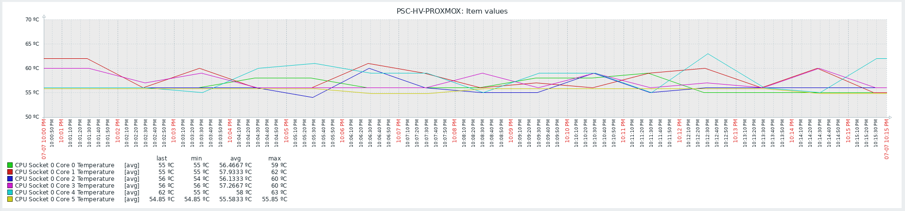

# LM-sensors Zabbix Template

Template for monitoring Intel / AMD Architecture x86 or x64 temperature with Zabbix.



## Prerequisites

- [x] System is linux and command for sensors is `sensors -u` (Debian, Ubuntu...)
- [x] You need to have installed sensors on your linux system.
- [x] Your system architecture need to be x86 (32b) or x86_x64 (64b)
- [x] Python3 installed
- [x] Zabbix Agent installed (tested with Zabbix Agent 2)

## Install process

Create a scripts directory on your agent config

```
mkdir /etc/zabbix/scripts
```

Copy Python script to the new directory

```
cp zbix-lmsensors.py /etc/zabbix/scripts/zbix-lmsensors.py
chmod +x /etc/zabbix/scripts/zbix-lmsensors.py
```

Copy config file to agent config folder

```
cp zbix-lmsensors.conf /etc/zabbix/zabbix_agent2.d
```

Restart agent

```
systemctl restart zabbix-agent2.service
```

## Last steps

Import template on your Zabbix and assign the template to the machine where you installed the script and config.

## Test

In the machine, on shell execute the command

```
/usr/bin/python3 -B /etc/zabbix/scripts/zbix-lmsensors.py
```

Check the results. For an Intel i5 10500T the output is 

```
[
  {
    "core_id": 0,
    "core_temp_now": 60,
    "core_temp_high": 80,
    "core_temp_critical": 100,
    "socket": 0,
    "index": 0
  },
  {
    "core_id": 1,
    "core_temp_now": 55,
    "core_temp_high": 80,
    "core_temp_critical": 100,
    "socket": 0,
    "index": 1
  },
  {
    "core_id": 2,
    "core_temp_now": 54,
    "core_temp_high": 80,
    "core_temp_critical": 100,
    "socket": 0,
    "index": 2
  },
  {
    "core_id": 3,
    "core_temp_now": 55,
    "core_temp_high": 80,
    "core_temp_critical": 100,
    "socket": 0,
    "index": 3
  },
  {
    "core_id": 4,
    "core_temp_now": 54,
    "core_temp_high": 80,
    "core_temp_critical": 100,
    "socket": 0,
    "index": 4
  },
  {
    "core_id": 5,
    "core_temp_now": 55.85,
    "core_temp_high": 65261.85,
    "core_temp_critical": 94.85,
    "socket": 0,
    "index": 5
  }
]
```

Some CPU have the same value for HIGH and CRITICAL temp, so if you want to force another temps you can pass this parameters

|Parameter|Required|Description|
|-|-|-|
|--set-high-temp|Optional|Set the value for HIGH temp|
|--set-critical-temp|Optional|Set the value for CRITICAL temp|

```
/usr/bin/python3 -B /etc/zabbix/scripts/zbix-lmsensors.py --set-high-temp 70 --set-critical-temp 95
```

Will overwrite the json output.

```
[
  {
    "core_id": 0,
    "core_temp_now": 60,
    "core_temp_high": 70,
    "core_temp_critical": 95,
    "socket": 0,
    "index": 0
  },
  {
    "core_id": 1,
    "core_temp_now": 60,
    "core_temp_high": 70,
    "core_temp_critical": 95,
    "socket": 0,
    "index": 1
  },
  {
    "core_id": 2,
    "core_temp_now": 64,
    "core_temp_high": 70,
    "core_temp_critical": 95,
    "socket": 0,
    "index": 2
  },
  {
    "core_id": 3,
    "core_temp_now": 59,
    "core_temp_high": 70,
    "core_temp_critical": 95,
    "socket": 0,
    "index": 3
  },
  {
    "core_id": 4,
    "core_temp_now": 64,
    "core_temp_high": 70,
    "core_temp_critical": 95,
    "socket": 0,
    "index": 4
  },
  {
    "core_id": 5,
    "core_temp_now": 57.85,
    "core_temp_high": 70,
    "core_temp_critical": 95,
    "socket": 0,
    "index": 5
  }
]
```
The script doesn't check if the high value is greater than critical, or if some of them is negative value... So it's in your hand to set a good values. Zabbix will use this fields to set the trigger thresholds.

## Template

The template comes with one item and one discovery rule.

### Prototype Items

- CPU Socket X Core Y Temperature

### Prototype Triggers

**CPU {#INDEX} temperature equal or greater than {#TEMP_HIGH}ºC**

When the temperature reaches the high value. This trigger has dependency on the next.

**CPU {#INDEX} temperature equal or greater than {#TEMP_CRITICAL}ºC**

When the temperature reaches the critical value


